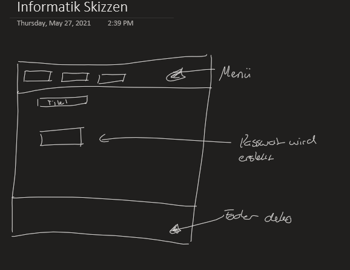
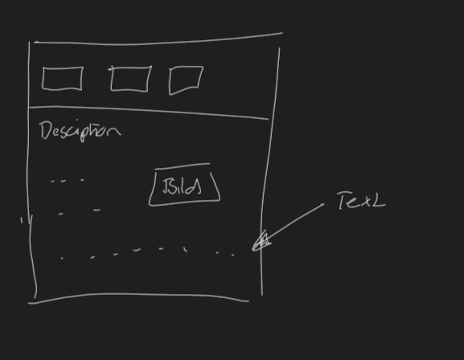
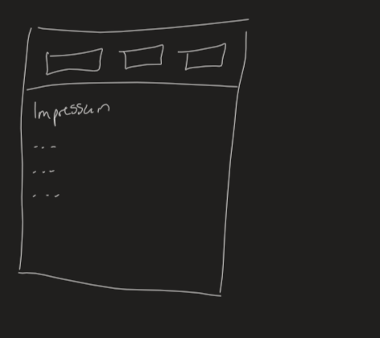

#  Passwort Generator
Ein Passwortgenerator für genug sichere Passwörter.

## **Beschreibung**

Hiermit wurde der Aufbau einfach skizziert.
Das Ziel dieses Projektes ist es dem Nutzer eine angenehme Webseite zu bauen, mit welcher er mit nur wenigen Klicks die Beschreibung, das Impressum und die Beschreibung der Webseite erreichen kann. Der Hauptteil wird der Passwort Generator sein bei welchem der Nutzer sich einfach ein nach seinen Wünschen personalisiertes Passwort erstellen lassen kann.

### **Hauptseite**

Die Hauptseite ist das Herz der Website. Mit dem verlinkten javascript-Code ist es möglich, sich ein Passwort generieren zu lassen. Mit math.random werden oben definierte Ziffern gewählt und zu einem Passwort zusammengestell
Hiermit wurde der Aufbau einfach skizziert.
Auf der Hauptseite (Index/Home) wird der gleiche Inhalt angezeigt, damit beim erstmaligen Betreten der Webseite bereits der Inhalt der Main-Seite verfügbar ist. Mit den Linktexten oben ist es möglich zu den verschiedenen Unterseiten zu gelangen. 

### **Beschreibung / Description**

In der Beschreibung der Webseite wird der Sinn und die Funktion eines sicheren Passwortes und dementsprechend auch unserer Webseite aufgezeigt.

### **Impressum**

Beim Impressum wurde auf eine saubere und übersichtliche Darstellung geachtet, bei der der Nutzer schnell und einfach die Daten der Ersteller bekommen kann.

## **Zeitplan**

Zeitplan mit mindestens wöchentlichen Meilensteinen. Wann setzt wann etwas um?

| 30.Mai 2021 | Janis Thüer & Milla Sambar| Projekt Webseiten Entwicklung |
| --- | --- | --- |
| 10.05.2021 | Milla Sambar |       Brainstorming                    |
| 10.05.2021 | Janis Thüer  |       Skizzen Zeichnung                |
| 17.05.2021 | Milla Sambar |       Erster Aufbau von "Home"         |
| 17.05.2021 | Milla Sambar | Aufbau des Codes vom Passwort Generator|
| 17.05.2021 | Janis Thüer  |       Imprint, Description Aufbau      |
| 24.05.2021 | Janis Thüer  |       README Bearbeitung               |
| 24.05.2021 | Milla Sambar |       Beendung Aufbau Main Code        |
| 26.05.2021 | Janis Thüer  |       CSS Allgemein                    |
| 26.05.2021 | Milla Sambar |       Index, Menu Gestaltung           |
| 28.05.2021 | Janis Thüer  |       Generelle Vollendung des Projekt |
| 30.05.2021 | Milla Sambar |       Generelle Vollendung des Projekt |

## **Zusammenfassung**

In diesem Projekt konnten wir trotz der stark begrenzten Zeit ein funktionierendes Resultat unseres Projektes erarbeiten. Den Zeitplan konnten wirnicht ganz einhalten und mussten ihn spontan in der Zeit und der Aufgabenteilung anpassen. Die Skizzen haben wir beachtet uns aber während der Arbeit für einzelne Änderungen entschieden, die für die Webseite mehr Sinn ergaben. Anfangs hatten wir Probleme in der Kommunikation und der Aufgabenteilung, die aber mit steigender Erfahrung und Zeit behoben werden konnten und wir auch die Zusammenarbeit einfacher und effizienter gestaltet hatten. 
Das Hauptziel, ein Passwortgenerator zu erstellen der für den Durchschnittsbenutzer sichere Passwörter kreiert, haben wir erreicht.

